> **Отчет по лабораторной работе №1 базовая настройка PostgreSQL на
> Debian**
>
> **Цимбалюк А.С. ИС-21**

1.  **Подготовка среды**

1.1  Обновляем список доступных пакетов из репозиториев: **apt-get
    update**;

1.2  Устанавливаем обновления для всех имеющихся пакетов: **apt-get
    upgrade**.

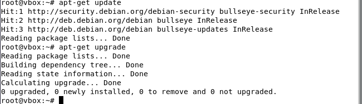

2.  **Установка PostgreSQL**

2.1  Устанавливаем PostgreSQL: **apt-get install postgresql**;

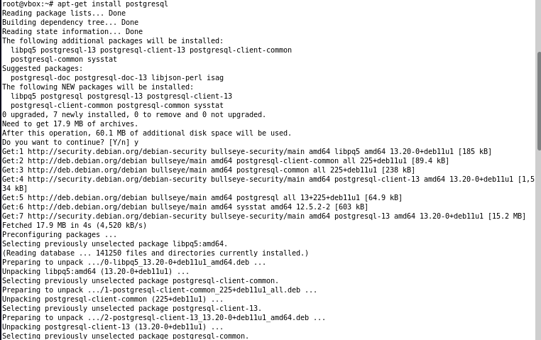

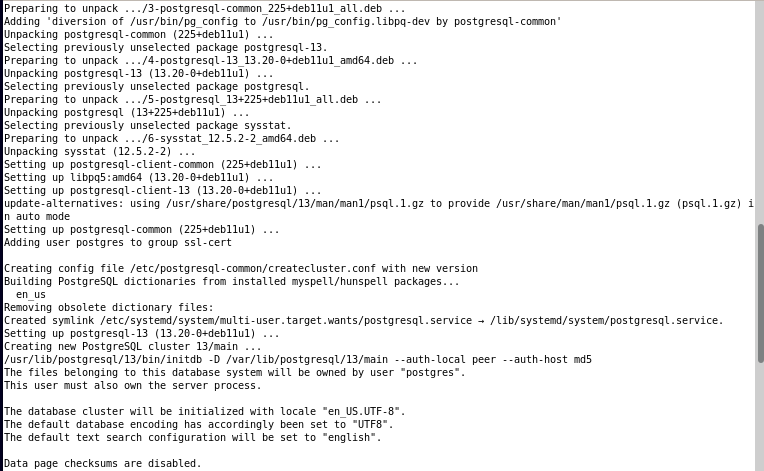

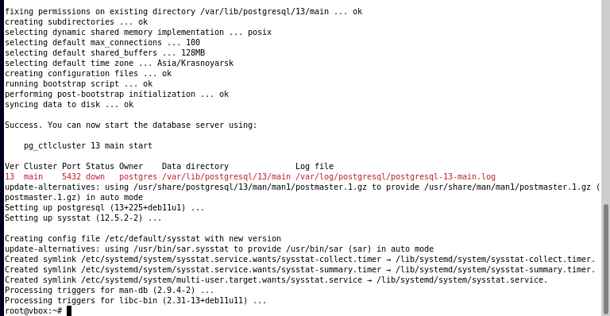

2.2  Устанавливаем клиентский пакет: **apt-get install
    PostgreSQL-client**;

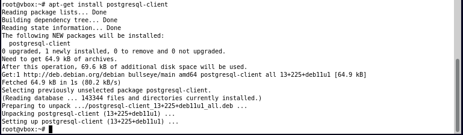

2.3  Проверяем статус службы: **systemctl status PostgreSQL**;

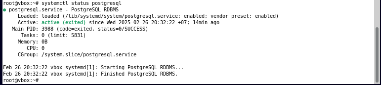

3.  **Создание служебной учётной записи**

3.1  Выводим содержимое файла/etc/passwd, где хранятся сведения о
    пользователях системы: **cat /etc/passwd**;

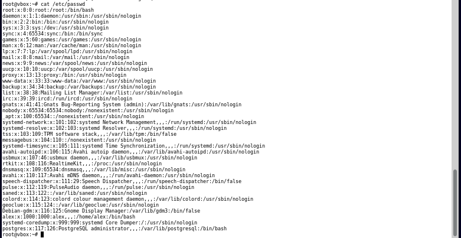

3.2  Для администрирования баз данных переходим на учётную запись
    администратора: **sudo -i -u postgres** ;

3.3  Запускаем оболочку PostgreSQL для выполнения SQL-запросов: **psql**
    ;

3.4  Выходим из psql (завершаем работу оболочки): **\\q** ;

3.5  Выходим из учётной записи администратора БД и возвращаемся к
    обычному пользователю: **exit** ;

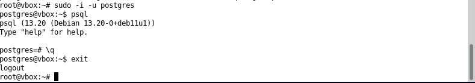

*Пользователь postgres в системе:*

-  Не имеет привилегий root, но управляет PostgreSQL.

-  Обладает полными правами на базы данных PostgreSQL.

-  Не может использовать sudo, так как это обычный системный
   пользователь.

-  Может запускать psql без пароля, так как является владельцем сервера БД.

4.  **Первичная настройка конфигурационных файлов**

4.1  Открываем каталог PostgreSQL версии 13 и просматриваем его
    содержимое: **ls /etc/postgresql/13** ;

4.2  Открываем каталог main, чтобы проверить, какие файлы находятся
    внутри: **sudo ls /etc/postgresql/13/main**;

 

4.3 Редактируем конфигурационный файл
    PostgreSQL, изменяя порт с 5432 на 5433: **sudo nano
    /etc/postgresql/13/main/postgresql.conf**;

4.4 Перезапускаем PostgreSQL, чтобы изменения вступили в силу: **sudo
    systemctl restart postgresql**;

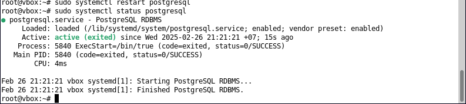

*Основные файлы конфигурации:*

postgresql.conf -- Основные настройки сервера. Этот файл управляет
параметрами работы PostgreSQL, такими как:

-   порт (port)

-   логирование (logging_collector, log_statement)

-   настройки памяти (shared_buffers, work_mem)

-   количество подключений (max_connections)

-   параметры сетевого доступа (listen_addresses)

pg_hba.conf -- настройки аутентификации. Этот файл определяет, какие
пользователи могут подключаться, с каких адресов и с каким методом
аутентификации.

pg_ident.conf -- связывает системных и базовых пользователей. Этот файл
позволяет привязать системные учётные записи Linux к пользователям
PostgreSQL

5.  **Управление сервисом**

-   Проверить статус: **systemctl status postgresql**;

-   Запустить сервер: **sudo systemctl start postgresql**;

-   Остановить сервер: **sudo systemctl stop postgresql**;

-   Перезапустить сервер: **sudo systemctl restart postgresql**;

-   Добавить в автозапуск: **sudo systemctl enable postgresql**;

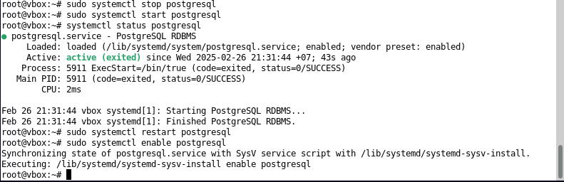

6.  **Создание тестовой базы данных**

6.1  Запускаем PostgreSQL: **psql**;

6.2 Создаём пользователя с паролем: **CREATE USER tsimbaliukA WITH
    PASSWORD \'1234\'**;

6.3 Создаём базу данных и назначаем владельца: **CREATE DATABASE
    DBtsimbaliukA OWNER tsimbaliukA**;

6.4 Выводим список пользователей: **\\du** ;

6.5 Выводим список баз данных: **\\l**;

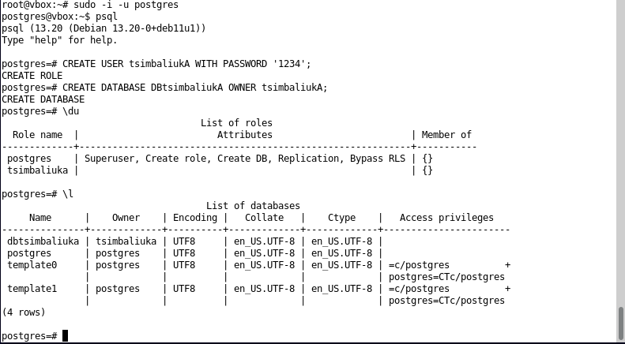

6.6 Входим в базу данных под созданным пользователем**:** **psql -U
    tsimbaliukA -d DBtsimbaliukA -W**;

  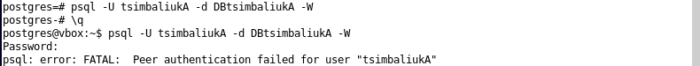 
  
6.7 Получаем ошибку: **FATAL: Peer authentication
    failed for user "tsimbaliukA"**. Это происходит из-за одноранговой
    аутентификации (peer), которая требует, чтобы имя пользователя в
    системе Linux совпадало с именем пользователя в PostgreSQL.

6.8 Изменяем метод аутентификации с **peer на md5** в файле
    **pg_hba.conf**, чтобы разрешить вход по паролю: **sudo nano
    /etc/postgresql/13/main/pg_hba.conf**;

 
 
 6.9 Находим строку, относящуюся к
    локальным подключениям, и заменяем peer на md5:

6.10 Сохраняем изменения и перезапускаем PostgreSQL: **sudo systemctl
    restart postgresql**;

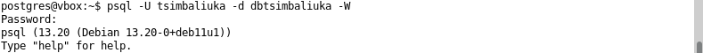

7.  **Знакомство со схемами**

7.1 Создаём схему test_schema: **CREATE SCHEMA test_schema**;

7.2 Даём пользователю tsimbaliukA права на использование схемы: **GRANT
    USAGE ON SCHEMA test_schema TO tsimbaliukA**;

7.3 Разрешаем пользователю tsimbaliukA создавать объекты в схеме:
    **GRANT CREATE ON SCHEMA test_schema TO tsimbaliukA**;

7.4 Пробуем выбрать данные из test_schema.public: **SELECT \* FROM
    test_schema.public**;

7.5 Создаём таблицу test_table в test_schema: **CREATE TABLE
    test_schema.test_table (**

**id SERIAL PRIMARY KEY,**

**name TEXT NOT NULL)**;

7.6 Просматриваем содержимое test_table: **SELECT \* FROM
    test_schema.test_table**;

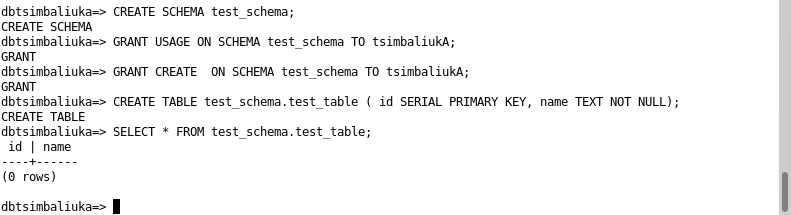

В PostgreSQL схема -- это логическая структура внутри базы данных,
которая группирует объекты, такие как таблицы, представления, индексы,
функции и т. д. Схема в PostgreSQL похожа на папку внутри базы данных.
Она позволяет организовывать объекты и управлять доступом к ним.
Допустим есть база данных company_db. Внутри неё можно создать разные
схемы:

• public -- стандартная схема, куда по умолчанию попадают все объекты.

• sales -- таблицы, связанные с продажами.

• hr -- таблицы, связанные с персоналом.

Вместо создания отдельных баз данных для разных отделов, можно
использовать схемы, что упрощает управление и доступ к данным.

8.  **Использование утилиты psql для базовых операций**

8.1  Использовали CREATE, INSERT и SELECT:

a.  **Создали таблицу cars** с полями id (автоинкрементный первичный
        ключ), stamp (марка автомобиля) и number (госномер): **CREATE
        TABLE public.cars (id SERIAL PRIMARY KEY, stamp TEXT NOT NULL,
        number TEXT NOT NULL)**;

b.  **Добавили данные** о трёх автомобилях: **INSERT INTO
        public.cars (stamp, number) VALUES (\'Toyota\', \'A011AA\'),
        (\'KIA\', \'A789CC\'), (\'BMW\', \'K524MA\')**;

c.  Просмотрели содержимое таблицы:
        **SELECT \* FROM public.cars**;
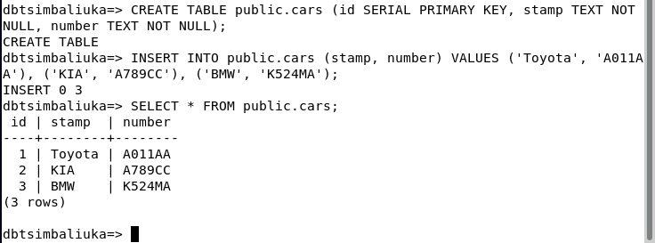

8.2  Обновили через UPDATE и удалили через DELETE:

a.  Обновили марку автомобиля с номером A011AA на Honda: **UPDATE
        public.cars SET stamp = \'Honda\' WHERE number = \'A011AA\'**;

b.  Проверили изменения с помощью SELECT: **SELECT \* FROM
        public.cars**;

c.  Удалили запись с маркой KIA: **DELETE FROM public.cars WHERE
        stamp = \'KIA\';**

d.  Просмотрели оставшиеся данные
        после удаления**:** **SELECT \* FROM public.cars;**

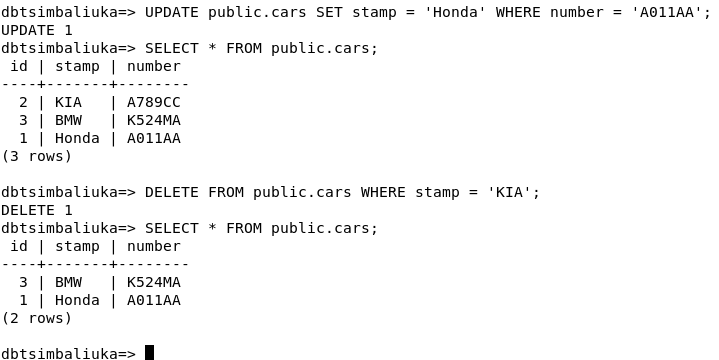

8.3  Создали таблицу и добавили данные:

a. **Создали таблицу test_table_sasha в
    схеме test_schema** с полями id (автоинкрементный первичный ключ),
    name (название) и country (страна):

 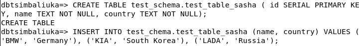

b.  Добавили в неё данные:
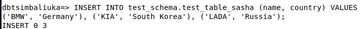

c.  Пробовали выбрать данные без указания схемы, но
    > получили ошибку, так как таблица находится в test_schema, а поиск
    > по умолчанию идёт в public. Подметим, что вывод таблицы cars при
    > этом спокойно выводится.
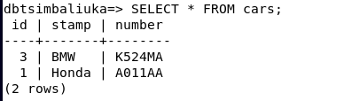

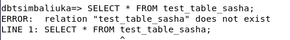

d.  Чтобы избавиться от ошибки, настроили search_path,
    > установили порядок поиска схем, добавив test_schema перед public.
    > Пробуем вывести и все выводится без ошибок, потому что мы
    > находимся уже в другом месте:
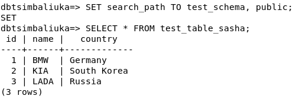

9.  **Настройка локальных и сетевых подключений**

9.1  Ввели команду для открытия файла и
    раскомментировали строку listen_addresses, убрав \# и заменив
    «localhost» на «\*». Это позволяет PostgreSQL принимать подключения
    не только локально, но и с других устройств в сети:
    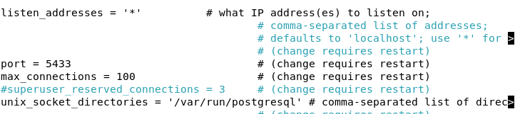

9.2  По аналогии зашли в файл pg_hba.conf и
    добавили строку: эта настройка разрешает подключения по сети (host)
    ко всем базам данных (all) от всех пользователей (all) с любого
    IP-адреса (0.0.0.0/0) с использованием метода аутентификации md5.
    
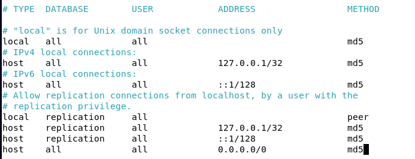

9.3  Перезапустили PostgreSQL, затем проверили, что сервер слушает
    подключения на порту **5433** для всех IP-адресов (0.0.0.0:\* и
    \[::\]:\*): **ss -tulnp \| grep postgres**
    

Команда ss -tulnp \| grep postgres используется для просмотра сетевых
соединений PostgreSQL:

-   ss --- позволяет быстро анализировать сетевые соединения.

-   -t --- показывает TCP соединения.

-   -u --- показывает UDP соединения.

-   -l --- отображает только прослушиваемые порты.

-   -n --- выводит IP-адреса и порты в числовом формате.

-   -p --- показывает PID процессов и связанные программы.

-   grep postgres --- фильтрует вывод, оставляя только строки, связанные
    с PostgreSQL.

9.4  Получаем адрес виртуальной машины командой **hostname -I** и
    производим подключение через pgadmin:

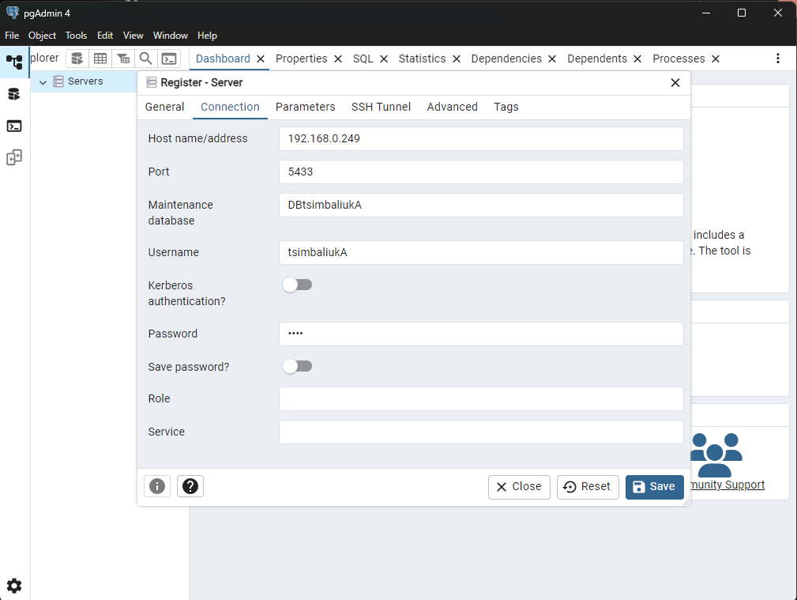

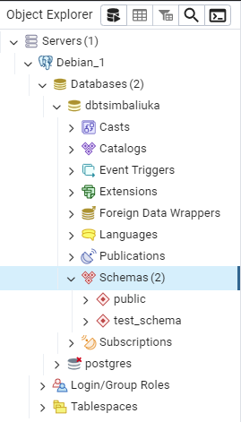

10. **Журналирование (logging)**

    10.1  Изменили настройки журналирования в
        postgresql.conf. Включили logging_collector = on, задали каталог
        логов (pg_log), формат имени файла и параметры логирования
        (log_statement = \'all\', log_connections = on,
        log_disconnections = on, log_duration = on).
        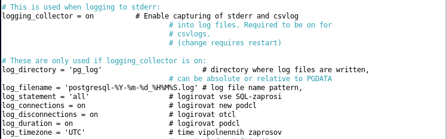

    10.2  Перезапустили сервис PostgreSQL.

    10.3  Проверили, что сервис работает.

    10.4  Нашли файлы логов в Debian и
        посмотрели их список: **ls /var/lib/postgresql/13/main/pg_log/**
        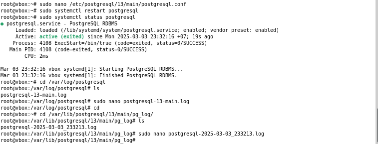

    10.5  Открыли лог и проверили записи: **sudo nano
        /var/lib/postgresql/13/main/pg_log/postgresql-2025-03-03_233213.log**

В логах видно SQL-запросы, подключения, отключения и время выполнения
запросов. Это подтверждает, что журналирование работает и новые записи
появляются.

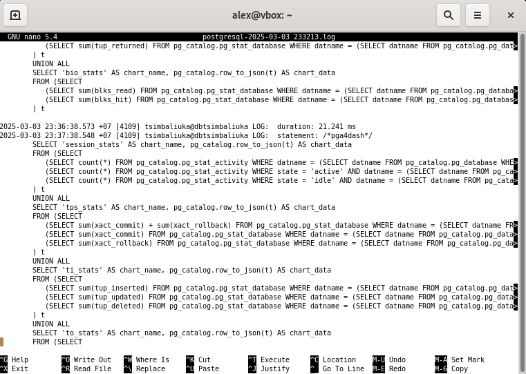

11. **Назначение ролей и прав**

    11.1  Создаём роль с ограниченными привилегиями limited_user: **CREATE
        ROLE limited_user WITH LOGIN PASSWORD \'8484\'**;

    11.2  Создаём базу данных lim_db: **CREATE DATABASE lim_db**;

    11.3  Подключаемся к базе lim_db: **\\c lim_db**

    11.4  Создаём таблицу cars: **CREATE TABLE cars ( id SERIAL PRIMARY
        KEY, name TEXT NOT NULL, number TEXT NOT NULL );**

    11.5  Добавляем записи в таблицу cars.

    11.6  Предоставляем limited_user доступ к базе: **GRANT CONNECT ON
        DATABASE lim_db TO limited_user;**

    11.7  Разрешаем использование схемы public: **GRANT USAGE ON SCHEMA
        public TO limited_user;**

    11.8  Выдаём права SELECT, INSERT,
        UPDATE на таблицу cars: **GRANT SELECT, INSERT, UPDATE ON
        public.cars TO limited_user;**
    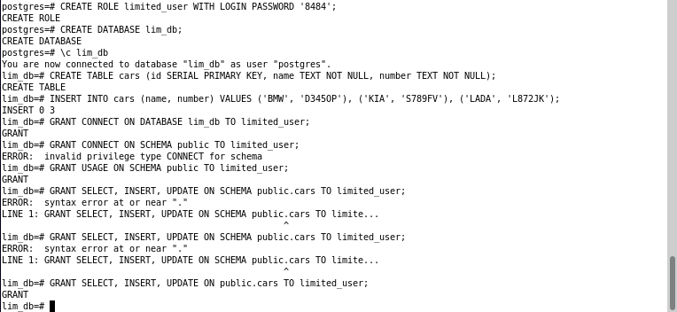

Теперь этот пользователь может читать, добавлять и изменять данные, но
не может удалять записи или изменять структуру таблицы.

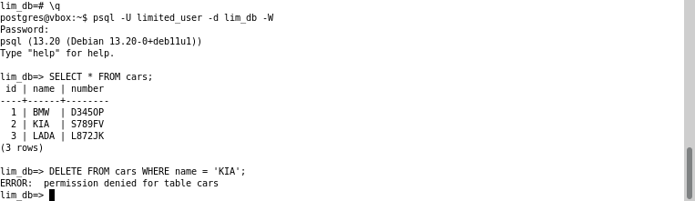

11.9  Создаём роль god и даём ей полные права на таблицу cars: **CREATE
    ROLE god; GRANT ALL PRIVILEGES ON cars TO god;**

11.10 Наследуем права god для limited_user, где limited_user получает все
    привилегии god.: **GRANT god TO limited_user;**

11.11 Подключаемся под limited_user и пробуем удалить и проверить данные:
    **DELETE FROM cars WHERE name = \'KIA\'; SELECT \* FROM cars;**
    Теперь limited_user, который ранее не имел прав на DELETE, теперь
    может удалять данные благодаря наследованию от god.

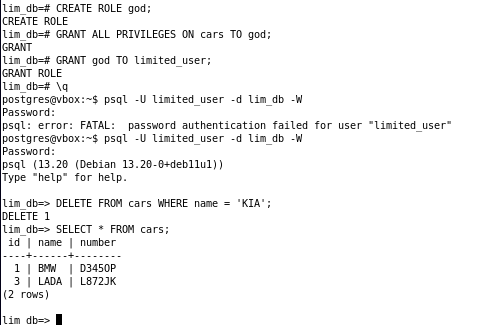

Роль limited_user унаследовала полные права на таблицу через god, что
позволило выполнять DELETE, несмотря на изначальные ограничения.
