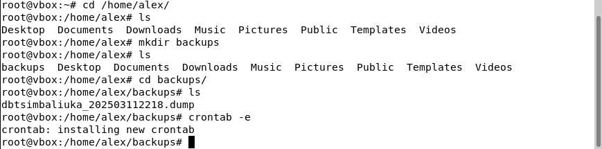

# Отчет по лабораторной работе №2. Резервное копирование, восстановление и мониторинг в Debian и PostgreSQL
### Цимбалюк А.С. ИС-21

## 1.  **Утилиты резервного копирования**

> В PostgreSQL есть две основные утилиты для резервного копирования:
> **pg_dump** и **pg_basebackup**. Они предназначены для разных задач и
> используются в зависимости от требований к бэкапу:

1.1.  **pg_dump:**  
Создаёт резервную копию отдельной базы данных в виде SQL-файла или архива. Этот файл содержит команды (CREATE, INSERT и т. д.), позволяющие воссоздать базу данных с нуля. Используется, когда:

> - нужно сохранить копию только одной базы, а не всего сервера;  
> - требуется перенести базу на другой сервер (например, с одной версии PostgreSQL на другую);  
> - нужно получить резервную копию в виде SQL-скрипта, который можно редактировать перед восстановлением.

1.2.  **pg_basebackup**:  
Выполняет **полное копирование всего сервера PostgreSQL**, включая базы данных, настройки, файлы данных и журналы транзакций. Используется, когда:

> - требуется создать полную копию сервера с сохранением всех данных;  
> - нужно настроить репликацию базы данных для отказоустойчивости;  
> - необходимо быстро восстановить базу в том же состоянии, в каком она была на момент создания копии;


### Сравнение pg_dump и pg_basebackup

| **Критерий**                        | **pg_dump**                                           | **pg_basebackup**                                                     |
|------------------------------------|-------------------------------------------------------|-----------------------------------------------------------------------|
| **Что копируется?**                | Одна база данных                                      | Весь сервер PostgreSQL                                                |
| **Формат копии**                   | SQL-файл или архив (можно редактировать)             | Физическая копия файлов базы (точный слепок сервера)                  |
| **Размер копии**                   | Меньше, т.к. сохраняются только нужные данные         | Больше, т.к. копируется всё, включая временные файлы и журналы        |
| **Основное применение**            | Перенос одной базы, создание SQL-скрипта для восстановления | Репликация сервера, полное резервное копирование              |
| **Можно ли редактировать копию?**  | Да, можно изменять SQL-файл перед восстановлением     | Нет, копия создаётся в неизменном виде                                |


## 2.  **Создание резервной копии**
>
> Для создания резервной копии базы данных была
> выполнена следующая команда:
>```bash
>pg_dump -U postgres -Fc -f dbtsimbakiuka_backup.dump dbtsimbaliuka
>```
> 

**Разбор команды:**

- `pg_dump` — утилита для создания резервных копий базы данных PostgreSQL;
- `-U postgres` — указание пользователя PostgreSQL (в данном случае `postgres`);
- `-Fc` — формат **custom**, который сжимает дамп и позволяет при восстановлении выбрать, какие данные восстанавливать;
- `-f dbtsimbaliuka_backup.dump` — путь и имя файла для резервной копии;
- `dbtsimbaliuka` — имя базы данных, которую нужно сохранить.

**Альтернативные параметры и их назначение:**

- `-Fp` — создаёт дамп в текстовом формате SQL (обычный текстовый файл с командами SQL);
- `-Ft` — создаёт дамп в формате **tar** (удобно для переноса между серверами);
- `-t <таблица>` — делает дамп только указанной таблицы;
- `-n <схема>` — сохраняет только указанную схему;
- `-T <таблица>` — исключает указанную таблицу из резервной копии;
- `-v` — включает подробный вывод процесса копирования;
- `--no-owner` — не сохраняет информацию о владельцах объектов (удобно для переноса на другой сервер).


## 3. **Частичное (выборочное) резервное копирование**

> Для создания резервной копии **отдельной** таблицы в базе данных  
> `dbtsimbaliuka` была использована следующая команда:
> ```bash
> pg_dump -U postgres -Fc -f selected_tables_backup.dump -t public.cars dbtsimbaliuka
> ```
> 
> 
Данная команда создала резервную копию **только одной таблицы** `cars`  
в файле `selected_tables_backup.dump` в формате **custom**.
> 
**После создания резервной копии были выполнены следующие шаги:**
> 3.1. Подключение к базе данных `dbtsimbaliuka` через `psql`;  
> 3.2. Удаление таблицы `cars` с целью последующего восстановления;  
> 3.3. Проверка отсутствия таблицы, подтверждая её удаление.


## 4. **Восстановление из резервной копии**

> После удаления таблицы `cars` была выполнена операция её восстановления с помощью утилиты **pg_restore**:
>
> ```bash
> pg_restore -U postgres -d dbtsimbaliuka -v selected_tables_backup.dump
> ```
>
> 

После восстановления можно увидеть повторный вывод ранее удалённой таблицы.  
Соответственно, резервное копирование работает как нужно.


## 5. **Автоматизация бэкапов с помощью cron**

Для того чтобы настроить `cron` для автоматического создания и удаления резервных копий базы данных `dbtsimbaliuka`, действуем по следующим шагам:

> **5.1.** Открываем файл `crontab` командой:
>
> ```bash
> crontab -e
> ```
>
> 
>
> **5.2.** Добавляем в него две строки:
>
> - **Первая команда** создаёт резервную копию каждые 2 минуты:
>
>   ```bash
>   */2 * * * * pg_dump -U postgres -Fc -f /home/alex/backups/dbtsimbaliuka_$(date +\%Y\%m\%d\%H\%M).dump dbtsimbaliuka
>   ```
>
> - **Вторая команда** удаляет файлы старше 15 минут:
>
>   ```bash
>   */15 * * * * find /home/alex/backups/ -name "*.dump" -type f -mmin +15 -exec rm {} \;
>   ```
>
> 
> 
>
> Проверяем содержимое папки `/home/alex/backups/`, чтобы убедиться, что файлы создаются каждые 2 минуты. Через некоторое время видим, что старые резервные копии удаляются, а новые продолжают появляться.  
> Ротация работает.
>
> 


## 6. **Мониторинг состояния системы**

>Для просмотра текущего состояния системы выполняем команду `top`. Здесь отображается информация о задачах, загрузке >процессора, использовании памяти и активных процессах.
>
>

#### 6.1. Задачи (Tasks):
- `total` — общее количество задач;
- `running` — выполняющиеся задачи;
- `sleeping` — задачи в ожидании;
- `stopped` — остановленные процессы;
- `zombie` — завершённые процессы, чьи родительские процессы не обработали их завершение.

#### 6.2. Загрузка процессора (%Cpu(s)):
- `us` — процент времени, используемый пользовательскими процессами;
- `sy` — процент времени, потраченный на системные процессы (ядро);
- `id` — процент простаивающего процессора;
- `wa` — ожидание ввода-вывода;
- `hi` — аппаратные прерывания;
- `si` — программные прерывания;
- `st` — время, «украденное» виртуальной машиной (актуально для виртуализации).

#### 6.3. Использование памяти (MiB Mem):
- `total` — общий объём оперативной памяти;
- `free` — свободная память;
- `used` — используемая память;
- `buff/cache` — память, выделенная под буферы и кеширование.


## 7.  **Мониторинг PostgreSQL**
Используем встроенные представления pg_stat_activity и pg_stat_database
для отслеживания активных процессов, длительных запросов и статистики
работы базы данных.

> 7.1. `pg_stat_activity` - мониторинг активных процессов в PostgreSQL. Это
>представление показывает все активные соединения, их текущее состояние и
>выполняющиеся запросы.
> ```bash
> SELECT pid, usename, application_name, state, query, query_start
> FROM pg_stat_activity
> WHERE state = \'active\';
> ```
>
>
>
>

-   `pid` - идентификатор процесса;

-   `usename` - имя пользователя, выполняющего запрос;

-   `application_name` - название приложения, инициировавшего запрос;

-   `state` - текущее состояние процесса (active, idle, idle in
    transaction);

-   `query` - выполняемый SQL-запрос;

-   `query_start` - время начала выполнения запроса.

> 7.2. Эта команда позволяет увидеть все процессы.
> ```bash
> SELECT pid, usename, application_name, state, query, query_start
> FROM pg_stat_activity;
> ```
> 
>

> 7.3.  Для поиска запросов, которые выполняются дольше пяти минут:
> ```bash
> SELECT pid, usename, application_name, state, query, query_start
> FROM pg_stat_activity
> WHERE state = \'active\'
> AND now() - query_start \> interval \'5 minutes\';
> ```
>
>

>7.4. `pg_stat_database` - статистика работы баз данных в PostgreSQL,
>```bash
>SELECT datname, numbackends, xact_commit, xact_rollback, blks_read, blks_hit
> FROM pg_stat_database;
>```
>
>

где:

-   `datname` - имя базы данных;

-   `numbackends` - количество активных подключений;

-   `xact_commit` - количество выполненных транзакций (COMMIT);

-   `xact_rollback` - количество отменённых транзакций (ROLLBACK);

-   `blks_read`- количество блоков, прочитанных с диска;

-   `blks_hit` - количество блоков, найденных в кэше PostgreSQL без
    обращения к диску.

>7.5 Эта команда завершает все активные запросы, выполняющиеся дольше 5
>минут. Используем её, если запрос перегружает систему или завис.
>Требуется роль суперпользователя.
>```bash
> SELECT pg_terminate_backend(pid)
> FROM pg_stat_activity
> WHERE state = \'active\'
> AND now() - query_start \> interval \'5 minutes\';
>```


## 8.  **Логирование и анализ логов**
**Логи - это файлы, в которых фиксируются события, происходящие в
системе и базе данных. Они помогают анализировать ошибки, отслеживать
работу сервисов и выявлять возможные проблемы.**

**Логи PostgreSQL хранятся в директории:**
>

**Логи всей виртуальной машины:**
>

>Логи PostgreSQL предназначены для отслеживания событий внутри базы
>данных. Они фиксируют информацию о выполненных запросах, ошибках при их
>обработке, подключениях и отключениях пользователей, а также о состоянии
>транзакций.
>
>В то же время системные логи Debian содержат сведения о работе всей
>операционной системы. Они включают информацию о процессе загрузки,
>функционировании ядра, обнаруженных ошибках оборудования и работе
>системных сервисов.
