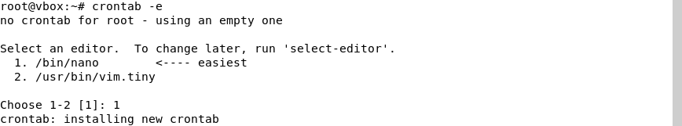
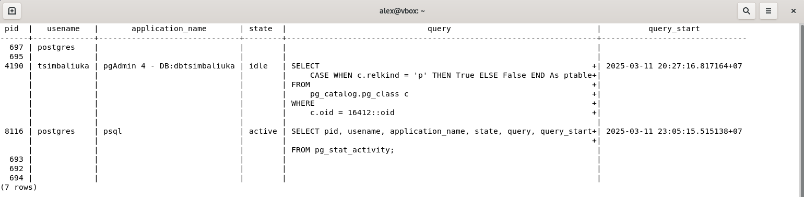

> **Отчет по лабораторной работе №1 базовая настройка PostgreSQL на
> Debian**
>
> **Цимбалюк А.С. ИС-21**

1.  **Утилиты резервного копирования**

В PostgreSQL есть две основные утилиты для резервного копирования:
pg_dump и pg_basebackup. Они предназначены для разных задач и
используются в зависимости от требований к бэкапу:

1.  **pg_dump:** создаёт резервную копию отдельной базы данных в виде
    SQL-файла или архива. Этот файл содержит команды (CREATE, INSERT и
    т. д.), позволяющие воссоздать базу данных с нуля. Используется,
    когда:

-   нужно сохранить копию только одной базы, а не всего сервера;

-   требуется перенести базу на другой сервер (например, с одной версии
    PostgreSQL на другую);

-   нужно получить резервную копию в виде SQL-скрипта, который можно
    редактировать перед восстановлением.

2.  **pg_basebackup**: выполняет **полное копирование всего сервера
    PostgreSQL**, включая базы данных, настройки, файлы данных и журналы
    транзакций. Используется, когда:

-   требуется создать полную копию сервера с сохранением всех данных;

-   нужно настроить репликацию базы данных для отказоустойчивости;

-   необходимо быстро восстановить базу в том же состоянии, в каком она
    была на момент создания копии;

Сравнение pg_dump и pg_basebackup:

  -----------------------------------------------------------------------
  Критерий                pg_dump                 pg_basebackup
  ----------------------- ----------------------- -----------------------
  Что копируется?         Одна база данных        Весь сервер PostgreSQL

  Формат копии            SQL-файл или архив      Физическая копия файлов
                          (можно редактировать)   базы (точный слепок
                                                  сервера)

  Размер копии            Меньше, т.к.            Больше, т.к. копируется
                          сохраняются только      всё, включая временные
                          нужные данные           файлы и журналы

  Основное применение     Перенос одной базы,     Репликация сервера,
                          создание SQL-скрипта    полное резервное
                          для восстановления      копирование

  Можно ли редактировать  Да, можно изменять      Нет, копия создаётся в
  копию?                  SQL-файл перед          неизменном виде
                          восстановлением         
  -----------------------------------------------------------------------

2.  **Создание резервной копии**


Для создания резервной копии базы данных была
выполнена следующая команда: pg_dump -U postgres -Fc -f
dbtsimbakiuka_backup.dump dbtsimbaliuka.

Разбор команды:

-   pg_dump -- утилита для создания резервных копий базы данных
    PostgreSQL;

-   -U postgres -- указание пользователя PostgreSQL (в данном случае
    postgres);

-   -Fc -- формат **custom**, который сжимает дамп и позволяет при
    восстановлении выбрать, какие данные восстанавливать;

-   -f dbtsimbakiuka_backup.dump -- путь и имя файла для резервной
    копии;

-   dbtsimbaliuka -- имя базы данных, которую нужно сохранить.

Альтернативные параметры и их назначение:

-   -Fp -- создаёт дамп в текстовом формате SQL (обычный текстовый файл
    с командами SQL);

-   -Ft -- создаёт дамп в формате **tar** (удобно для переноса между
    серверами);

-   -t \<таблица\> -- делает дамп только указанной таблицы;

-   -n \<схема\> -- сохраняет только указанную схему;

-   -T \<таблица\> -- исключает указанную таблицу из резервной копии;

-   -v -- включает подробный вывод процесса копирования;

-   \--no-owner -- не сохраняет информацию о владельцах объектов (удобно
    для переноса на другой сервер).

3.  **Частичное (выборочное) резервное копирование**

Для создания резервной копии отдельной таблицы в базе данных
dbtsimbaliuka была использована следующая команда: pg_dump -U postgres
-Fc -f selected_tables_backup.dump -t public.cars dbtsimbaliuka.


Данная команда создала резервную копию только одной таблицы cars в файле
selected_tables_backup.dump в формате custom.

После создания резервной копии были выполнены следующие шаги:

1.  

2.  

3.  1.  подключение к базе данных dbtsimbaliuka через psql;

    2.  удаление таблицы cars с целью позднее восстановить ее;

    3.  проверка наличия таблицы, подтверждая ее удаление.

```{=html}
<!-- -->
```
3.  **Восстановление из резервной копии**


После удаления таблицы cars была выполнена
операция её восстановления с помощью утилиты pg_restore: pg_restore -U
postgres -d dbtsimbaliuka -v selected_tables_backup.dump.

После восстановления можно увидеть повторный вывод ранее удаленной
таблицы. Соответственно резервное копирование работает как нужно.

4.  **Автоматизация бэкапов с помощью cron**

Для того, чтобы настроить cron для автоматического создания и удаления
резервных копий базы данных dbtsimbaliuka действуем по следующим шагам:

4.  

    1.  открываем файл crontab командой: crontab -e.

    2.  Добавляем в него две строки. Первая команда создаёт резервную
        копию каждые 2 минуты, вторая удаляет файлы старше 15 минут:

-   \*/2 \* \* \* \* pg_dump -U postgres -Fc -f
    > /home/alex/backups/dbtsimbaliuka\_\$(date
    > +\\%Y\\%m\\%d\\%H\\%M).dump dbtsimbaliuka

-   \*/15 \* \* \* \* find /home/alex/backups/ -name \"\*.dump\" -type f
    > -mmin +15 -exec rm {} \\;


Проверяем содержимое папки /home/alex/backups/, чтобы убедиться, что
файлы создаются каждые 2 минуты. Через некоторое время видим, что старые
резервные копии удаляются, а новые продолжают появляться. Ротация
работает.


5.  **Мониторинг состояния системы**

Для просмотра текущего состояния системы выполняем команду top. Здесь
отображается информация о задачах, загрузке процессора, использовании
памяти и активных процессах.


1.  Задачи (Tasks):

-   total -- общее количество задач;

-   running -- выполняющиеся задачи;

-   sleeping -- задачи в ожидании;

-   stopped -- остановленные процессы;

-   zombie -- завершённые процессы, чьи родительские процессы не
    обработали их завершение.

    1.  Загрузка процессора (%Cpu(s)):

```{=html}
<!-- -->
```
-   **us** -- процент времени, используемый пользовательскими
    процессами;

-   **sy** -- процент времени, потраченный на системные процессы (ядро);

-   **id** -- процент простаивающего процессора;

-   **wa** -- ожидание ввода-вывода;

-   **hi** -- аппаратные прерывания;

-   **si** -- программные прерывания;

-   **st** -- время, «украденное» виртуальной машиной (актуально для
    виртуализации);

    1.  Использование памяти (MiB Mem):

```{=html}
<!-- -->
```
-   **total** -- общий объём оперативной памяти;

-   **free** -- свободная память;

-   **used** -- используемая память;

-   **buff/cache** -- память, выделенная под буферы и кеширование;

6.  **Мониторинг PostgreSQL**

Используем встроенные представления pg_stat_activity и pg_stat_database
для отслеживания активных процессов, длительных запросов и статистики
работы базы данных.

1.  SELECT pid, usename, application_name, state, query, query_start

> FROM pg_stat_activity
>
> WHERE state = \'active\';

pg_stat_activity --- мониторинг активных процессов в PostgreSQL. Это
представление показывает все активные соединения, их текущее состояние и
выполняющиеся запросы.


-   pid --- идентификатор процесса;

-   usename --- имя пользователя, выполняющего запрос;

-   application_name --- название приложения, инициировавшего запрос;

-   state --- текущее состояние процесса (active, idle, idle in
    transaction);

-   query --- выполняемый SQL-запрос;

-   query_start --- время начала выполнения запроса.

    1.  SELECT pid, usename, application_name, state, query, query_start

> FROM pg_stat_activity;



Эта команда позволяет увидеть все процессы.

2.  Для поиска запросов, которые выполняются дольше пяти минут:

SELECT pid, usename, application_name, state, query, query_start

FROM pg_stat_activity

WHERE state = \'active\'

AND now() - query_start \> interval \'5 minutes\';


3.  SELECT datname, numbackends, xact_commit, xact_rollback, blks_read,
    blks_hit

> FROM pg_stat_database;


pg_stat_database --- статистика работы баз данных в PostgreSQL, где:

-   datname --- имя базы данных;

-   numbackends --- количество активных подключений;

-   xact_commit --- количество выполненных транзакций (COMMIT);

-   xact_rollback --- количество отменённых транзакций (ROLLBACK);

-   blks_read --- количество блоков, прочитанных с диска;

-   blks_hit --- количество блоков, найденных в кэше PostgreSQL без
    обращения к диску.

    1.  SELECT pg_terminate_backend(pid)

> FROM pg_stat_activity
>
> WHERE state = \'active\'
>
> AND now() - query_start \> interval \'5 minutes\';

Эта команда завершает все активные запросы, выполняющиеся дольше 5
минут. Используем её, если запрос перегружает систему или завис.
Требуется роль суперпользователя.

7.  **Логирование и анализ логов**

Логи --- это файлы, в которых фиксируются события, происходящие в
системе и базе данных. Они помогают анализировать ошибки, отслеживать
работу сервисов и выявлять возможные проблемы.


Логи PostgreSQL хранятся в директории:

Логи всей виртуальной машины:


Логи PostgreSQL предназначены для отслеживания событий внутри базы
данных. Они фиксируют информацию о выполненных запросах, ошибках при их
обработке, подключениях и отключениях пользователей, а также о состоянии
транзакций.

В то же время системные логи Debian содержат сведения о работе всей
операционной системы. Они включают информацию о процессе загрузки,
функционировании ядра, обнаруженных ошибках оборудования и работе
системных сервисов.
