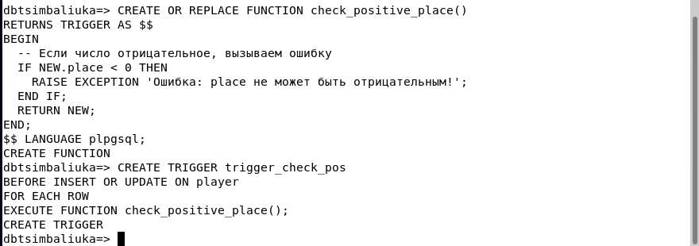

# Отчет по лабораторной работе №3: Расширенные возможности и оптимизация PostgreSQL на Debian
### Цимбалюк А.С. ИС-21

## 1.  **Оптимизация конфигурации PostgreSQL**

### Настройка конфигурации PostgreSQL

>Открываем файл конфигурации и вносим изменения:
>```bash
>sudo nano /etc/postgresql/13/main/postgresql.conf
>```
>
>
>

### В файле конфигурации были изменены следующие параметры:
- `shared_buffers` = 1250MB - размер буферного кеша PostgreSQL. Используется для хранения данных в RAM, снижая нагрузку на диск. Обычно 25-40% от оперативной памяти;
  
- `work_mem` = 8MB - объем памяти для операций сортировки и хеширования (ORDER BY, JOIN). Настраивается в зависимости от нагрузки;
  
- `maintenance_work_mem` = 128MB - выделенная память для VACUUM и создания индексов. Обычно 10-15% от RAM;
  
- `effective_cache_size` = 2GB - размер кеша чтения ОС. PostgreSQL использует это значение для оценки доступности данных в памяти перед чтением с диска.

### Чтобы изменения вступили в силу, необходимо перезапустить службу:
>```bash
>sudo systemctl restart postgresql
>```
>

### Проверяем, что изменения применились: 
>```bash
>SHOW shared_buffers; SHOW work_mem;
>SHOW maintenance_work_mem;
>SHOW effective_cache_size;`.
>```
>
>
> Вывод подтверждает, что новые параметры успешно загружены.
>
В результате настройки были оптимизированы параметры памяти PostgreSQL,
что положительно влияет на производительность, снижая нагрузку на диск и
ускоряя выполнение запросов.


## 2.  **Создание и анализ индексов**

### Вначале создадим таблицу `player` и заполним её данными, используя `generate_series`, чтобы добавить 999 999 записей:
>```bash
>CREATE TABLE player (idSERIAL PRIMARY KEY, place INTEGER);
>```
>```bash
>INSERT INTO player(place) SELECT generate_series(1, 999999);
>```
>

### Выполним `EXPLAIN` и `EXPLAIN ANALYZE` для поиска записи с `place = 752020`:
>```bash
>EXPLAIN SELECT * FROM player WHERE place = 752020;
>```
>
>```bash
>EXPLAIN ANALYZE SELECT * FROM player WHERE place = 752020;
>```
>
>
>Вывод показывает, что PostgreSQL выполняет последовательное сканирование
>(`Seq Scan`) всей таблицы, проверяя каждую строку.

### Недостатки `Seq Scan`:
- База просматривает все строки, что занимает много времени;
- Чем больше данных, тем дольше выполняется запрос.

### Добавляем индекс на `place`, чтобы ускорить поиск: 
>```bash
>CREATE INDEX idx_place ON player(place);
>```

### После создания индекса снова выполняем запрос: 
>```bash
>EXPLAIN ANALYZE SELECT * FROM player WHERE place = 752020;
>```
>  
>

### Преимущества `Index Scan`:
- Запрос выполняется в сотни раз быстрее;
- Система ищет только нужные строки вместо полного сканирования
  таблицы.

В PostgreSQL `EXPLAIN` и `EXPLAIN ANALYZE` используются для анализа
выполнения SQL-запросов, но между ними есть важные различия. `EXPLAIN`
показывает план выполнения запроса без его фактического выполнения,
оценивает предполагаемые затраты и количество обработанных строк.
`EXPLAIN ANALYZE` выполняет запрос и дополнительно выводит реальное
время выполнения, фактическое количество строк и другие показатели
производительности.

Когда PostgreSQL выполняет запрос без индекса, он перебирает каждую
строку таблицы по порядку, как если бы искали нужное слово в книге,
читая каждую страницу подряд. Если в таблице есть индекс, поиск
происходит быстрее — это как поиск слова в словаре, где сначала
проверяют первую букву, затем следующую, и сразу находят нужное место,
не просматривая весь текст. Использование индекса сокращает время
выполнения запроса, так как PostgreSQL сразу переходит к нужным данным.

## 3.  **Хранимые функции**

Хранимая функция `check_place(p_check INTEGER)` позволяет проверять значение перед вставкой в таблицу `player`.  
Если число отрицательное, она возвращает ошибку, если положительное — добавляет его в таблицу.

### Код функции
>Функция написана на языке `plpgsql`, который позволяет использовать логические конструкции внутри SQL-запросов:
>
>```sql
>CREATE OR REPLACE FUNCTION check_place(p_check INTEGER)
>RETURNS TEXT AS $$
>BEGIN
>    -- Проверяем, является ли число отрицательным
>    IF p_check < 0 THEN
>        RETURN 'Ошибка: отрицательное значение!';
>    ELSE
>        -- Если число положительное, вставляем его в таблицу player
>        INSERT INTO player(place) VALUES (p_check);
>        RETURN 'Запись добавлена: ' || p_check;
>    END IF;
>END;
>$$ LANGUAGE plpgsql;
>```
### Выполнение функции
>Выполняем команды:
>```sql
>SELECT check_place(-18);
>```
>```sql
>SELECT check_place(18);
>```
>

### Проверка результата
>Проверим, добавилась ли запись:
>```sql
>SELECT * FROM player WHERE place = 18;
>```
>
>
>Запись с числом 18 действительно добавлена.


## 4.  **Триггеры**

Мы создали триггерную функцию и сам триггер, которые следят за тем,  
чтобы в таблице `player` нельзя было вставить или обновить значение `place`,  
если оно отрицательное.

### Создание триггерной функции
>```sql
>CREATE OR REPLACE FUNCTION check_positive_place()
>RETURNS TRIGGER AS $$
>BEGIN
>    -- Если число отрицательное, вызываем ошибку
>    IF NEW.place < 0 THEN
>        RAISE EXCEPTION 'Ошибка: place не может быть отрицательным!';
>    END IF;
>    RETURN NEW;
>END;
>$$ LANGUAGE plpgsql;
>```

### После создания триггерной функции создаем триггер:
>```sql
>CREATE TRIGGER trigger_check_pos
>BEFORE INSERT OR UPDATE ON player
>FOR EACH ROW EXECUTE FUNCTION check_positive_place();
>```
### Он делает следующее:
>- Он срабатывает до (`BEFORE`) выполнения `INSERT` или `UPDATE` в таблице `player`;
>- Каждая строка (`FOR EACH ROW`) перед изменением проверяется через функцию `check_positive_place()`;
>- Если значение `place` меньше 0, триггер вызовет ошибку и не даст выполнить запрос.
> 
>

### Проверяем работу триггера и триггерной функции:
>

Как результат видим, что при попытке ввода отрицательного значения или  
обновления существующей записи на отрицательное значение срабатывает  
триггер и триггерная функция. Триггер работает корректно и предотвращает  
ошибки данных.


## 5.  **Автоматическая очистка и статистика (VACUUM, ANALYZE)**

Когда в PostgreSQL выполняются операции `INSERT`, `UPDATE` или `DELETE`, в таблицах остаются "мёртвые" строки, которые больше не используются.  
PostgreSQL не удаляет их автоматически, а просто помечает как ненужные. Если их не очищать, размер базы будет расти, а запросы начнут работать медленнее.

### Для очистки этих данных используется `VACUUM` и `ANALYZE`:
>- `VACUUM` удаляет "мусорные" строки и освобождает место в базе;  
>- `ANALYZE` обновляет статистику, чтобы оптимизировать планы выполнения запросов.

PostgreSQL может автоматически выполнять очистку с помощью `autovacuum`.  
Открываем файл конфигурации и выставляем следующие параметры настройки:

>- `autovacuum_naptime = 30s` — интервал проверки таблиц (по умолчанию 1 минута);
>- `autovacuum_vacuum_scale_factor = 0.05` — когда начинать очистку (5% "мусорных" строк);
>- `autovacuum_analyze_scale_factor = 0.02` — когда обновлять статистику (2% изменённых строк).

### Проверяем, включен ли autovacuum:
>```sql
>SHOW autovacuum;
>```
>

### Если требуется очистить таблицу вручную:
>```sql
>VACUUM ANALYZE player;
>```
>

### Посмотреть дату последнего autovacuum или ручного VACUUM:
>```sql
>SELECT relname, n_live_tup, n_dead_tup, last_autovacuum, last_vacuum
>FROM pg_stat_user_tables
>WHERE relname = 'player';
>```
где:
>- `n_live_tup` — количество активных строк;  
>- `n_dead_tup` — количество "мёртвых" строк;  
>- `last_autovacuum` — время последнего autovacuum;  
>- `last_vacuum` — время последнего ручного VACUUM.
>
>

### Можно также проверить использование индексов:
>```sql
>SELECT relname, indexrelname, idx_scan, idx_tup_read, idx_tup_fetch
>FROM pg_stat_all_indexes
>WHERE schemaname = 'public';
>```
где:
>- `idx_scan` — сколько раз индекс использовался;  
>- `idx_tup_read` — сколько строк прочитано с индексом;  
>- `idx_tup_fetch` — сколько строк реально использовано.
>
>

Таким образом, `VACUUM` и `ANALYZE` помогают поддерживать производительность базы,  
очищая ненужные данные и обновляя статистику для оптимизации запросов.

